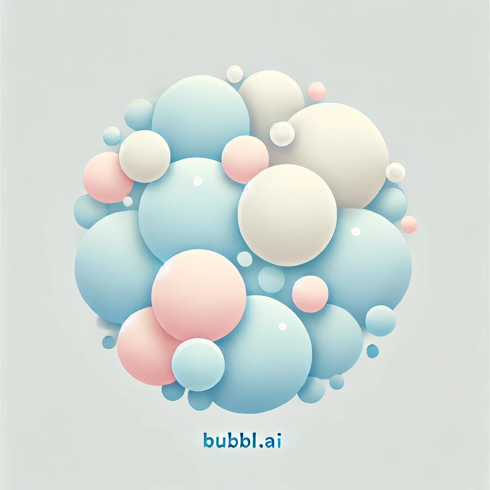

## Bubbl.ai: Capture, Connect, Converse.

</img>

Ever found yourself repeating the same conversation with different people, over and over again? Whether it's discussing politics, debating life philosophies, or simply explaining your point of view, it can be exhausting. Enter **Bubbl.ai**, a revolutionary way to immortalize your thoughts, opinions, and conversations — without ever having to repeat yourself again.

### What is Bubbl.ai?

Bubbl.ai is more than just an app. It's a personal archive for your ideas, a platform to connect with like-minded individuals, and a tool for self-expression—all rolled into one. Whether you’re deep in a conversation or just jotting down a quick thought, Bubbl.ai saves your ideas and organizes them into dynamic "bubbles" that you can revisit and share with others.

### Bubbling: A New Way to Communicate

Instead of typing the same ideas or having repetitive discussions with different people, you can **bubble** your thoughts and opinions. Like tweeting or posting, but smarter. Each bubble represents a crystallized idea, discussion, or argument, ready to be shared or referenced. Bubbl.ai saves your energy, letting you skip the redundant conversations while still engaging meaningfully.

### Never Lose an Idea

With Bubbl.ai, you’ll never waste a well-formed argument or idea again. Each conversation or thought you bubble is stored forever, allowing you to pull it up whenever you need it. Even better? Bubbl.ai helps you grow and refine these ideas over time. It's a personal vault for your thoughts, where nothing is lost and everything is at your fingertips.

### Find Your People

Ever wonder if someone else is thinking the same way you are? With Bubbl.ai’s **user similarity ranking**, you can search through a database of users who have bubbled on the same topics and compare your ideas based on a similarity score. Bubbl.ai will show you who resonates with your thoughts on specific topics—whether it’s philosophy, technology, or social issues—using advanced matching algorithms like cosine similarity.

### The Power of Collaboration

Imagine being able to form instant connections with people who think like you, or challenge your ideas to evolve through engaging conversations. Bubbl.ai doesn't just collect your thoughts, it connects you to other users based on common ideas. You can compare bubbles, engage in meaningful debates, or even form meetups with individuals who share your passions.

### Your Feed, Your Interests

The Bubbl.ai feed is powered by a smart search engine that curates **your universe of thoughts**. You can explore popular topics such as “The future of AI” or “Mental health hacks for the modern world,” and dive deep into bubbles from users across the platform. With every search query, you’ll discover similar users and their bubbles, creating endless opportunities for conversation and growth.

### Why Bubbl.ai?

* **Stop repeating yourself**: Save your best ideas and reuse them whenever you want.
* **Engage smarter**: Avoid the time-consuming back-and-forth by sharing bubbles instead of lengthy conversations.
* **Connect deeply**: Discover like-minded individuals based on real thoughts and opinions, not just interests or profiles.
* **Grow over time**: Your bubbles evolve with you, so your conversations today can influence the person you become tomorrow.

### Are You Ready to Bubble?

Join a new era of communication where your thoughts become tangible, sharable, and forever connected to a world of thinkers like you. Be a part of the **Bubbl.ai revolution** — because your thoughts deserve to be more than just fleeting words.