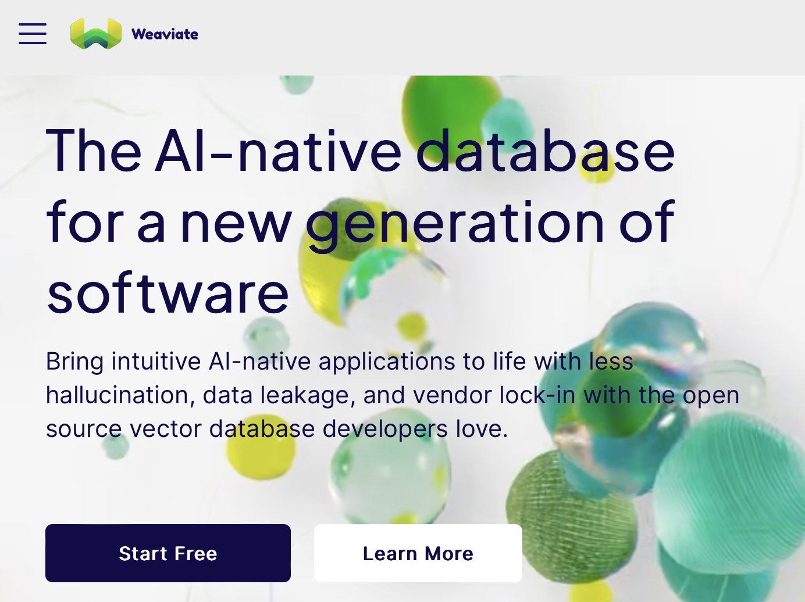
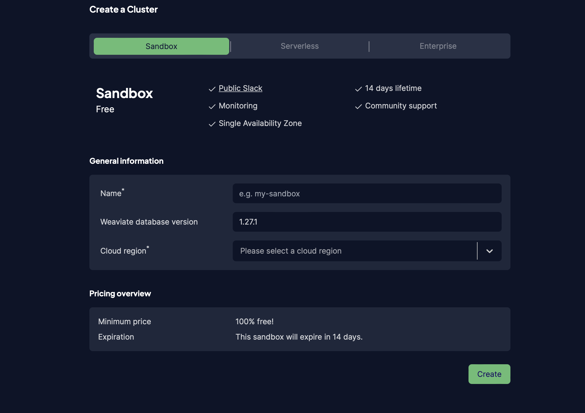
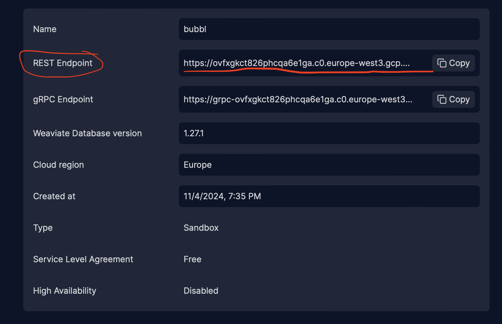
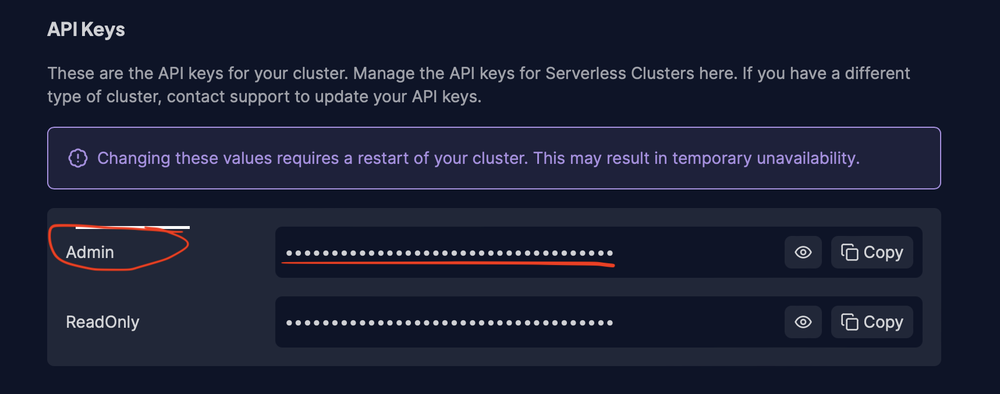

# Bubbl.ai Setup Guide

This markdown file provides instructions for setting up the Bubbl.ai application using Docker or a local environment. Follow the steps below to get started.

### Table of Contents

1. [Setup](#setup)
    - [Prerequisites](#prerequisites)
    - [Easy Setup with Docker](#easy-setup-with-docker)
    - [Docker Alternative: Local Setup (MacOS)](#docker-alternative-local-setup)
3. [API Keys](#api-keys)
    - [Admin Username, Password, Secret Key, Debug](#admin-username-password-secret-key-debug)
    - [OpenAI API](#openai-api)
    - [Weaviate Cluster](#weaviate-cluster-api)

### Setup

Follow the steps below to set up the Bubbl.ai application on your local machine.

#### Prerequisites

Make sure Docker and Docker Desktop is installed on your local machine. If not, you can download it from the [official Docker website](https://www.docker.com/products/docker-desktop).

Clone the Bubbl.ai repository to your local machine using the following command:

```bash
git clone https://www.github.com/yamaceay/bubbl.ai.git
```

#### Easy Setup with Docker

Create a `.env` file with the following content in the root directory:

```bash
ADMIN_USERNAME=your-admin-username
ADMIN_PASSWORD=your-admin-password
OPENAI_API_KEY=your-openai-api-key
WCS_API_KEY=your-weaviate-cluster-api-key
WCS_URL=your-weaviate-cluster-url
SECRET_KEY=your-flask-secret-key
DEBUG=true
```

Read the section <a href=#api-keys>API Keys</a> below to find out how to generate the keys needed.

Build and run the Docker image using the following command:

```bash
docker-compose up --build
```

Now, you can access the app at `https://127.0.0.1:5001`. Enjoy!

#### Docker Alternative: Local Setup

Make sure Python 3.11 (or newer) is installed on your local machine. MacOS is preferred. Then, run `pip3 install -r requirements.txt` to install all packages. After that, set the following environment variables as specified above.

After setting, you're ready to go. Just run `python3 app.py --host 127.0.0.1` and enjoy!

### API Keys

Below, you can find instructions on how to generate the environment variables needed for the Bubbl.ai application.

#### Admin Username, Password, Secret Key, Debug

You can set these values as you like. The secret key is used for securely signing the session cookie. The debug mode is set to `True` for development purposes. The admin username and password are used for logging in as an admin and being able to insert / remove bubbles in bulk.

#### OpenAI API

You can get your OpenAI API key by signing up at [OpenAI](https://platform.openai.com/)

#### Weaviate Cluster API

You can get your Weaviate Cluster API key by signing up at [Weaviate](https://www.semi.technology/developers/weaviate/current/getting-started.html). 



Click "Start Free" to open the [Weaviate console](https://console.weaviate.cloud/).

After logging in, create a new Sandbox cluster. Choose a cluster name, then select your region. It may take a few minutes to set up the cluster.



After the cluster is created, click on the cluster name to open the cluster dashboard. The REST endpoint is your `WCS_URL`. 



Scroll below to see the access keys. The admin key is your `WCS_API_KEY`.



Now, you're all set to use the Weaviate cluster.